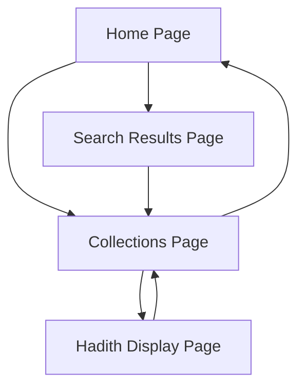

# Radiant Hadith - Product Requirements Document

## 1. Product Overview
Radiant Hadith is a modern web application that provides users with easy access to authentic Islamic hadith collections from renowned scholars. The application offers a beautiful, user-friendly interface for exploring, reading, and sharing hadith texts in both Arabic and English.

The product serves Muslims and Islamic scholars who need quick access to verified hadith collections for study, reference, and spiritual guidance. It bridges traditional Islamic scholarship with modern web technology to make hadith more accessible to a global audience.

## 2. Core Features

### 2.1 User Roles
This application does not require user registration or role-based access. All features are available to all visitors as a public resource.

### 2.2 Feature Module
Our hadith explorer consists of the following main pages:
1. **Home page**: hero section with search functionality, browse collections button, Islamic-themed design
2. **Collections page**: grid display of available hadith books, book selection interface
3. **Hadith display page**: individual hadith viewer with Arabic text, translation, and sharing options
4. **Search results page**: placeholder for future search functionality

### 2.3 Page Details

| Page Name | Module Name | Feature description |
|-----------|-------------|---------------------|
| Home page | Hero section | Display welcome message, search input field, browse collections button with Islamic styling |
| Home page | Navigation | Provide access to main application features and branding |
| Collections page | Book grid | Display available hadith collections in card format with book names, hadith counts, and selection buttons |
| Collections page | Loading states | Show loading indicators while fetching book data from API |
| Collections page | Error handling | Display error messages if API requests fail |
| Hadith display | Arabic text display | Show original Arabic hadith text in large, readable font with proper RTL formatting |
| Hadith display | Translation display | Present English translation in clear, readable format |
| Hadith display | Metadata display | Show hadith number, collection name, and source attribution |
| Hadith display | Action buttons | Provide copy, share, and favorite functionality for individual hadiths |
| Search results | Placeholder content | Display message about search functionality being unavailable, redirect to browse collections |

## 3. Core Process

**Main User Flow:**
1. User lands on the home page and sees the hero section with search and browse options
2. User clicks "Browse Collections" to view available hadith books
3. User selects a hadith collection to explore
4. System fetches and displays a random hadith from the selected collection
5. User can copy, share, or favorite the hadith
6. User can navigate back to collections or home page

**Search Flow (Future Enhancement):**
1. User enters search query on home page
2. System displays placeholder message about search unavailability
3. User is redirected to browse collections instead

## 4. User Interface Design

### 4.1 Design Style
- **Primary colors**: Islamic-inspired gold and green tones with modern gradients
- **Secondary colors**: Muted backgrounds with card-based layouts
- **Button style**: Rounded corners with subtle shadows and hover effects
- **Font**: Modern sans-serif for English text, traditional Arabic fonts for hadith text
- **Layout style**: Card-based design with backdrop blur effects and Islamic geometric patterns
- **Icons**: Lucide React icons for consistent modern iconography

### 4.2 Page Design Overview

| Page Name | Module Name | UI Elements |
|-----------|-------------|-------------|
| Home page | Hero section | Large gradient background, centered content, search input with icon, prominent CTA button, Arabic subtitle text |
| Home page | Typography | Large heading fonts, Islamic color scheme, responsive text sizing |
| Collections page | Book cards | Grid layout, hover effects, book icons, progress indicators, metadata display |
| Collections page | Loading states | Centered spinner with loading text, consistent with brand colors |
| Hadith display | Content layout | Two-column approach with Arabic text highlighted, translation in prose format |
| Hadith display | Action bar | Icon buttons for copy, share, favorite with tooltips and feedback |

### 4.3 Responsiveness
The application is mobile-first and fully responsive, with:
- Adaptive grid layouts that stack on mobile devices
- Touch-optimized button sizes and spacing
- Responsive typography that scales appropriately
- Mobile-friendly navigation with back buttons
- Optimized Arabic text rendering across devices