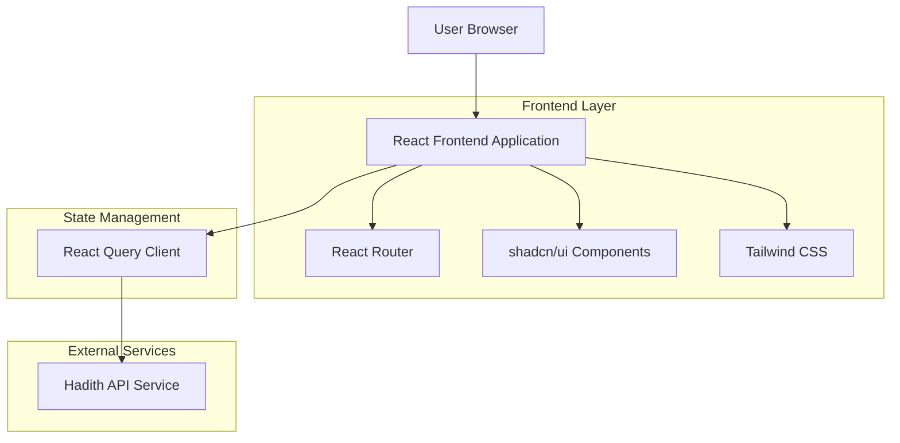
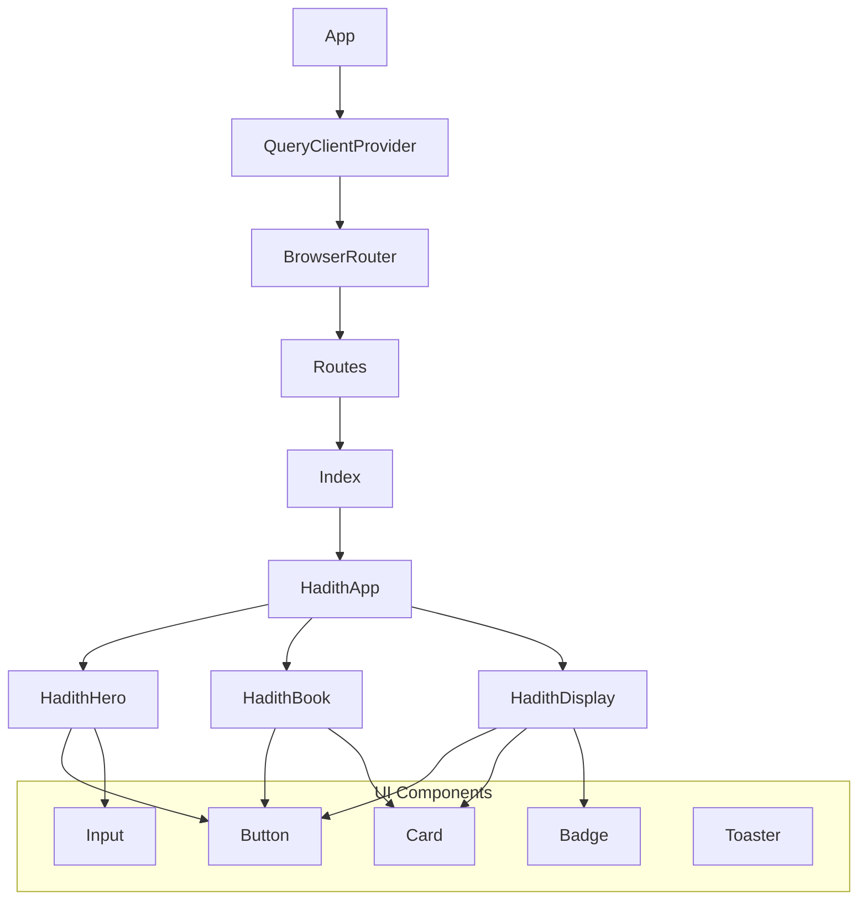
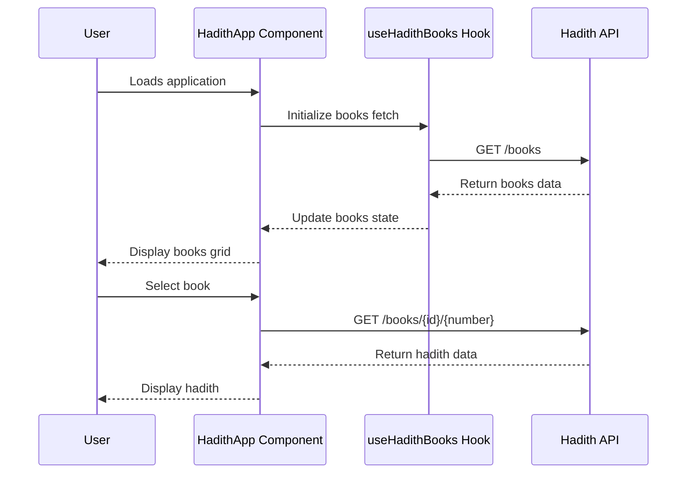

# Jelajah Hadits - Technical Architecture Document

## 1. Architecture Design



## 2. Technology Description

- Frontend: React@18 + TypeScript + Vite
- UI Framework: shadcn/ui + Radix UI components
- Styling: Tailwind CSS@3 + CSS custom properties
- State Management: React Query (TanStack Query)@5
- Routing: React Router DOM@6
- HTTP Client: Native Fetch API
- Icons: Lucide React
- Build Tool: Vite@5
- Package Manager: npm/bun

## 3. Route Definitions

| Route | Purpose |
|-------|---------|
| / | Home page with hero section and main navigation |
| * | Catch-all route that displays NotFound component |

Note: The application uses internal state management for view modes (home, books, hadith, search) rather than separate routes for each view.

## 4. API Definitions

### 4.1 External API Integration

The application integrates with the Hadith API (api.hadith.gading.dev) for all hadith data.

**Get All Books**
```
GET https://api.hadith.gading.dev/books
```

Response:
| Param Name | Param Type | Description |
|------------|------------|-------------|
| code | number | HTTP status code |
| message | string | Response message |
| data | HadithBook[] | Array of hadith books |
| error | boolean | Error status |

HadithBook Type:
```typescript
interface HadithBook {
  name: string;     // Book name (e.g., "Sahih Bukhari")
  id: string;       // Book identifier
  available: number; // Number of available hadiths
}
```

**Get Single Hadith**
```
GET https://api.hadith.gading.dev/books/{bookId}/{number}
```

Request Parameters:
| Param Name | Param Type | isRequired | Description |
|------------|------------|------------|-------------|
| bookId | string | true | Book identifier |
| number | number | true | Hadith number |

Response:
```typescript
interface HadithData {
  name: string;      // Book name
  id: string;        // Book identifier
  available: number; // Total available hadiths
  contents: {
    number: number;  // Hadith number
    arab: string;    // Arabic text
    id: string;      // English translation
  };
}
```

**Get Hadith Range**
```
GET https://api.hadith.gading.dev/books/{bookId}?range={start}-{end}
```

Request Parameters:
| Param Name | Param Type | isRequired | Description |
|------------|------------|------------|-------------|
| bookId | string | true | Book identifier |
| start | number | true | Starting hadith number |
| end | number | true | Ending hadith number |

## 5. Component Architecture

### 5.1 Component Hierarchy



### 5.2 Key Components

**HadithApp** (`src/pages/HadithApp.tsx`)
- Main application component managing view states
- Handles navigation between home, books, hadith, and search views
- Manages selected hadith state and API interactions

**HadithHero** (`src/components/HadithHero.tsx`)
- Landing page hero section with search functionality
- Islamic-themed design with gradient backgrounds
- Search form and browse collections button

**HadithBook** (`src/components/HadithBook.tsx`)
- Individual book card component
- Displays book metadata and selection interface
- Hover effects and progress indicators

**HadithDisplay** (`src/components/HadithDisplay.tsx`)
- Individual hadith viewer component
- Arabic text display with proper RTL formatting
- Action buttons for copy, share, and favorite functionality

### 5.3 Custom Hooks

**useHadithBooks** (`src/hooks/useHadithAPI.ts`)
- Fetches and manages hadith books data
- Handles loading states and error management
- Returns books array, loading state, and error state

**useHadith** (`src/hooks/useHadithAPI.ts`)
- Provides functions for fetching individual hadiths
- Supports both single hadith and range queries
- Manages loading and error states for hadith requests

**useToast** (`src/hooks/use-toast.ts`)
- Toast notification management
- Used for user feedback on actions like copy and error states

**useMobile** (`src/hooks/use-mobile.tsx`)
- Responsive design helper hook
- Detects mobile viewport for conditional rendering

## 6. Data Flow

### 6.1 Application State Management



### 6.2 Error Handling Strategy

- API errors are caught and displayed via toast notifications
- Loading states prevent user interaction during data fetching
- Fallback UI for failed API requests
- Graceful degradation for missing data

## 7. Styling Architecture

### 7.1 Tailwind Configuration

- Custom color palette with Islamic-inspired themes
- Extended gradients for hero sections and cards
- Custom shadows and animations
- Responsive breakpoints for mobile-first design

### 7.2 Component Styling Patterns

- shadcn/ui base components with custom variants
- CSS custom properties for theme consistency
- Backdrop blur effects for modern glass morphism
- Islamic geometric patterns and gold accents

## 8. Build and Development

### 8.1 Development Setup

```bash
# Install dependencies
npm install

# Start development server
npm run dev

# Build for production
npm run build

# Preview production build
npm run preview
```

### 8.2 Project Structure

```
src/
├── components/          # Reusable UI components
│   ├── ui/             # shadcn/ui base components
│   ├── HadithBook.tsx  # Book card component
│   ├── HadithDisplay.tsx # Hadith viewer component
│   └── HadithHero.tsx  # Hero section component
├── hooks/              # Custom React hooks
│   ├── useHadithAPI.ts # API integration hooks
│   ├── use-toast.ts    # Toast notifications
│   └── use-mobile.tsx  # Responsive utilities
├── pages/              # Page components
│   ├── HadithApp.tsx   # Main application
│   ├── Index.tsx       # Home page wrapper
│   └── NotFound.tsx    # 404 page
├── lib/                # Utility functions
│   └── utils.ts        # Helper functions
└── assets/             # Static assets
    └── fonts/          # Custom fonts
```

### 8.3 Performance Considerations

- React Query for efficient data caching and synchronization
- Lazy loading of hadith content
- Optimized bundle size with Vite
- Responsive images and assets
- Minimal API calls with smart caching strategies